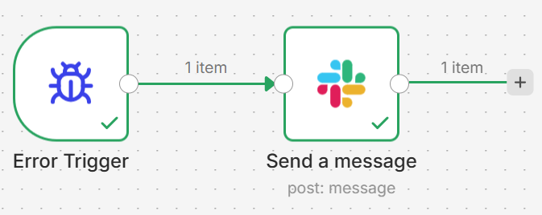

# Retail Territory Margin Analysis | SQL

**Tools:** SQL (SQLite) | **Dataset:** 9,995 orders across US states | **Focus:** Territory profitability & margin risk

---

## Business Question

> *Which US territories are most and least profitable — and what is driving the gap?*

---

## Dataset

| Column | Description |
|---|---|
| `Order ID` | Unique order identifier |
| `Sales` | Revenue per order |
| `Profit` | Profit per order |
| `Shipping Cost Per Unit` | Shipping cost |
| `Net_Margin_pct` | Net margin as a percentage |
| `State` | US state |
| `Conversion_Flag` | Whether order converted |

- **9,995 rows** across multiple US states
- Merged from 3 source files

---

## SQL Queries & Findings

### Average margin by state

```sql
SELECT State, 
       ROUND(AVG(Net_Margin_pct), 2) AS avg_margin,
       COUNT("Order ID") AS total_orders
FROM retail
GROUP BY State
ORDER BY avg_margin DESC
```

**Top performing states by margin:**

| State | Avg Margin | Total Orders |
|---|---|---|
| District of Columbia | 42.20% | 10 |
| Iowa | 39.93% | 30 |
| Arkansas | 37.95% | 60 |
| South Dakota | 37.75% | 12 |

**Insight:** Highest margin states are all low volume — suggesting untapped growth potential in profitable markets.

---

### Low margin orders by state (below 10%)

```sql
SELECT State,
       COUNT("Order ID") AS low_margin_orders
FROM retail
WHERE Net_Margin_pct < 10
GROUP BY State
ORDER BY low_margin_orders DESC
```

**Most problematic states:**

| State | Low Margin Orders |
|---|---|
| Texas | 585 |
| California | 378 |
| Pennsylvania | 331 |
| Illinois | 310 |
| Ohio | 257 |

**Insight:** Texas alone accounts for 585 low margin orders — nearly double California. These are high volume states where pricing or shipping costs are severely eroding profitability.

---

### Total sales, profit and margin by state

```sql
SELECT State,
       ROUND(SUM(Sales), 2) AS total_sales,
       ROUND(SUM(Profit), 2) AS total_profit,
       ROUND(AVG(Net_Margin_pct), 2) AS avg_margin
FROM retail
GROUP BY State
ORDER BY total_profit DESC
```

**Top states by revenue:**

| State | Total Sales | Total Profit | Avg Margin |
|---|---|---|---|
| California | $457,687 | $76,381 | 27.83% |
| New York | $310,876 | $74,038 | 29.84% |
| Washington | $138,641 | $33,402 | 27.64% |
| Michigan | $76,269 | $24,463 | 33.34% |
| Indiana | $53,555 | $18,382 | 34.79% |

**Insight:** California and New York generate the most revenue but have the lowest margins among top states. Indiana and Georgia show healthier margin profiles despite lower revenue.

---

### Full territory overview

```sql
SELECT State,
       ROUND(AVG(Net_Margin_pct), 2) AS avg_margin,
       ROUND(SUM(Sales), 2) AS total_sales,
       ROUND(SUM(Profit), 2) AS total_profit,
       COUNT("Order ID") AS total_orders,
       SUM(CASE WHEN Net_Margin_pct < 10 THEN 1 ELSE 0 END) AS low_margin_orders
FROM retail
GROUP BY State
ORDER BY total_sales DESC
LIMIT 10
```

### Territory performance (grouped regions)
```sql
SELECT 
  CASE 
    WHEN State IN ('California','Oregon','Washington',
    'Nevada','Arizona') THEN 'West'
    WHEN State IN ('Texas','Oklahoma','Kansas','Missouri',
    'Arkansas','Louisiana') THEN 'Central'
    WHEN State IN ('New York','Pennsylvania','New Jersey',
    'Massachusetts','Virginia','Florida','Georgia',
    'North Carolina') THEN 'East'
    ELSE 'Other'
  END AS Territory,
  ROUND(SUM(Sales), 2) AS total_sales,
  ROUND(SUM(Profit), 2) AS total_profit,
  ROUND(AVG(Net_Margin_pct), 2) AS avg_margin,
  ROUND(AVG("Shipping Cost Per Unit"), 2) AS avg_shipping,
  ROUND(AVG(CAST(Conversion_Flag AS FLOAT))*100, 2) 
  AS conversion_pct,
  COUNT("Order ID") AS total_orders
FROM retail
GROUP BY Territory
ORDER BY total_profit DESC
```

**Insight:** This combined view reveals the full picture — allowing direct comparison of revenue, profitability and margin risk side by side across all territories.

---

## Key Business Insights

1. **Biggest markets = worst margins.** California ($457K revenue) and New York ($310K) both sit below 30% average margin with hundreds of low margin orders. The business appears to be over-discounting to compete in large, saturated markets.

2. **Texas is a triple red flag.** 585 low margin orders, doesn't appear in top revenue states, and isn't a high margin state — high volume, low revenue, low profit.

3. **Mid-size states are the hidden winners.** Indiana (34.79%), Georgia (34.52%) and Michigan (33.34%) show consistently healthy margins with far fewer low margin problem orders — these states represent the most profitable operating model.

4. **Small states show huge margin potential.** District of Columbia (42.2%) and Iowa (39.93%) have very few orders but exceptional margins — targeted expansion here could be high ROI.

---

## Business Recommendation

> The data suggests a **pricing strategy review** is needed for California and Texas specifically. The pattern of high volume + low margin in large states indicates either aggressive discounting, high shipping costs, or both. Replicating the pricing approach used in Indiana and Georgia across larger markets could significantly improve overall profitability.

---

**Tableau**
[Tableau](https://public.tableau.com/views/RetailTerritoryMarginAnalysis/RetailTerritoryPerformanceAnalysis?:language=en-GB&:sid=&:redirect=auth&:display_count=n&:origin=viz_share_link)

---

**Territory results:**

| Territory | Total Sales | Total Profit | Avg Margin | Avg Shipping | Conversion |
|---|---|---|---|---|---|
| West | $665K | $108K | 23.76% | $6.61 | 84.59% |
| East | $756K | $98K | 16.81% | $3.94 | 95.53% |
| Other | $638K | $86K | 8.98% | $5.96 | 94.04% |
| Central | $235K | **-$7,397** | -19.9% | $9.16 | 95.98% |

**Key insight:** Central territory has 96% conversion but is the only territory losing money — -$7,397 total profit on $235K sales. The culprit is $9.16 average shipping cost, more than double East's $3.94.

---

## Python Analysis (Google Colab)

Verified and extended the SQL findings using Python:
```python
import pandas as pd

df = pd.read_csv('retail_shipping_sample.csv')

# margin from raw figures
df['Net_Margin_calc'] = (df['Profit'] / df['Sales']) * 100

# low margin orders
df['Low_Margin_Flag'] = df['Net_Margin_calc'] < 10

print(f"Total orders: {len(df)}")
print(f"Low margin orders: {df['Low_Margin_Flag'].sum()}")
print(f"Percentage: {df['Low_Margin_Flag'].mean()*100:.1f}%")
```

**Output:**
- Total orders: 9,994
- Low margin orders: 2,934
- Percentage: **29.4% of all orders are below 10% margin**

---

## Automation (n8n + Make.com)

Built automated workflows to monitor low margin orders without manual intervention:

**n8n workflow:**
- Schedule trigger → Google Sheets (reads 9,995 rows) → IF condition (margin < 10%) → Gmail alert
- Automatically flags low margin orders daily and notifies the responsible team


**Error handling workflow:**


**Error handling:** A separate error workflow monitors 
the main flow — if Google Sheets is unavailable or 
Slack fails, an automatic alert fires to #margin-alerts 
with the error details and timestamp. This ensures the 
pipeline never fails silently.

**Make.com workflow:**
- Schedule trigger → Google Sheets → Filter (margin < 10%) → Loop each row → Gmail alert
- Processes each flagged row individually with order-level detail in the email


**Business value:** A manager receives automatic daily alerts about underperforming orders without opening a single spreadsheet — enabling faster pricing and cost decisions.

**n8n workflow file:** `slack workflow.json` 
— import directly into n8n to replicate this automation

---

## Excel Analysis

Built a PivotTable in Excel summarising average margin by state with conditional formatting:
Red — states below 10% margin
Green — states above 30% margin

**Problem states flagged:** Texas, Illinois, Colorado, Pennsylvania, Ohio, Arizona, Oregon, Florida, Tennessee, North Carolina, Wyoming

## Files

- `retail_shipping_sample.csv` — merged dataset (9,995 rows)
- `queries.sql` — all SQL queries used in this analysis

---

*Analysis by Monika Kwiatkowska | [LinkedIn](https://www.linkedin.com/in/monikakwiatkowska) | [Portfolio](https://github.com/monikkwiatkowska)*

